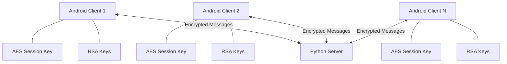
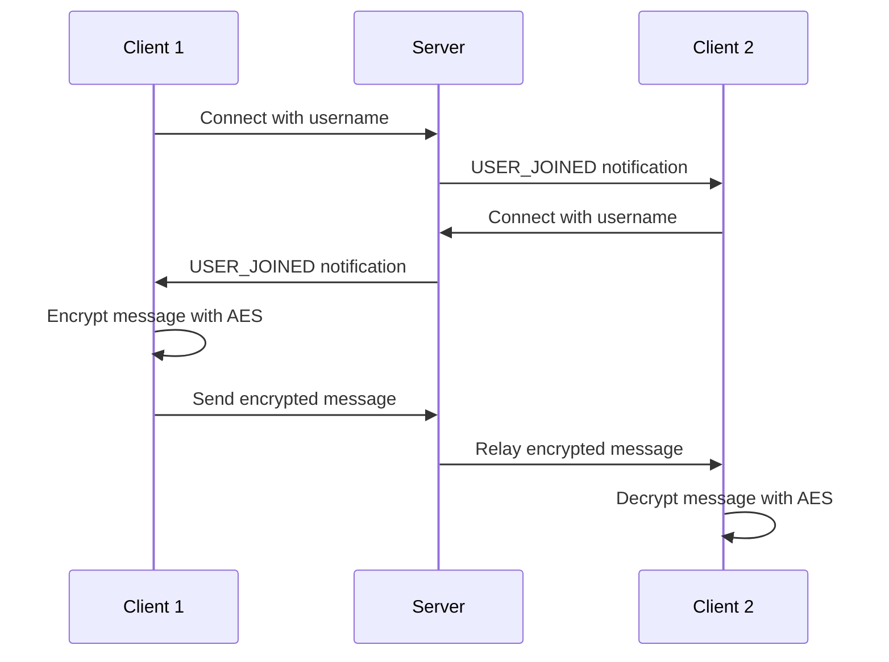

# Secure Messenger Architecture

## Overview

The Secure Messenger implements end-to-end encryption using a hybrid approach combining RSA and AES cryptography. It consists of an Android client application and a Python server for relaying messages between users.

## System Components



## Key Components

### 1. Android Client

#### Core Classes:
- [MainActivity.kt](file:///Users/triplexx/project/app/src/main/java/com/example/securemessenger/MainActivity.kt) - Entry point that launches the chat activity
- [RealChatActivity.kt](file:///Users/triplexx/project/app/src/main/java/com/example/securemessenger/RealChatActivity.kt) - Main chat interface with network capabilities
- [NetworkManager.kt](file:///Users/triplexx/project/app/src/main/java/com/example/securemessenger/NetworkManager.kt) - Handles all network communication
- [CryptoUtils.kt](file:///Users/triplexx/project/app/src/main/java/com/example/securemessenger/CryptoUtils.kt) - Provides cryptographic functions
- [Message.kt](file:///Users/triplexx/project/app/src/main/java/com/example/securemessenger/Message.kt) - Data class for UI messages
- [NetworkMessage.kt](file:///Users/triplexx/project/app/src/main/java/com/example/securemessenger/NetworkMessage.kt) - Data class for network messages
- [MessageAdapter.kt](file:///Users/triplexx/project/app/src/main/java/com/example/securemessenger/MessageAdapter.kt) - RecyclerView adapter for displaying messages

#### Cryptographic Implementation:

1. **Key Generation**:
   - Each client generates an RSA key pair (2048-bit) for asymmetric encryption
   - Each client generates an AES key (256-bit) for symmetric encryption of messages

2. **Message Encryption**:
   - User messages are encrypted using the AES key
   - AES-encrypted messages are encoded in Base64 for transmission
   - (Future enhancement: AES key exchange using RSA encryption)

3. **Security Features**:
   - All messages are encrypted before transmission
   - Keys are stored in memory only (not persisted)
   - Network communication uses plain TCP sockets (can be enhanced with TLS)

### 2. Python Server

#### [server.py](file:///Users/triplexx/project/server.py):
- Implements a multi-threaded TCP server
- Relays messages between connected clients
- Manages client connections and usernames
- Broadcasts system messages (user joined/left)

#### Server Features:
- Accepts connections from multiple clients
- Routes messages between clients
- Handles client disconnections gracefully
- Lightweight implementation with minimal dependencies

## Communication Flow



## Data Flow

1. **User Input**:
   - User types a message in the EditText field
   - Message is encrypted with AES key before sending

2. **Network Transmission**:
   - Encrypted message is wrapped in NetworkMessage object
   - JSON serialized and sent over TCP socket
   - Server receives and broadcasts to all connected clients

3. **Message Reception**:
   - Client receives encrypted message from server
   - Displays encrypted Base64 string in UI
   - (Optional decryption for display - currently messages remain encrypted)

## Security Considerations

### Current Implementation:
- Messages are encrypted end-to-end with AES
- Keys are generated per session (not persisted)
- Network messages are Base64 encoded (not compressed)

### Limitations:
- No authentication between clients
- AES key exchange not implemented (same key used by all clients in demo)
- No certificate validation for connections
- Server knows encrypted message content (semi-trusted)

### Future Enhancements:
- Implement proper RSA key exchange for AES keys
- Add user authentication and registration
- Implement TLS for network connections
- Add message integrity verification
- Store keys securely using Android Keystore

## Directory Structure

```
project/
├── app/                          # Android application
│   ├── src/main/java/           # Kotlin source code
│   │   └── com/example/securemessenger/
│   │       ├── CryptoUtils.kt   # Cryptographic utilities
│   │       ├── MainActivity.kt  # Entry point
│   │       ├── RealChatActivity.kt  # Main chat interface
│   │       ├── NetworkManager.kt    # Network communication
│   │       ├── NetworkMessage.kt    # Network message model
│   │       ├── Message.kt           # UI message model
│   │       └── MessageAdapter.kt    # RecyclerView adapter
│   └── src/main/res/            # Resources
│       ├── layout/              # XML layouts
│       └── values/              # String resources
├── gradle/                      # Gradle wrapper
├── server.py                    # Python relay server
├── build.gradle                 # Build configuration
├── gradlew/gradlew.bat          # Gradle scripts
└── README.md                    # Documentation
```

## Build Process

1. **Gradle Configuration**:
   - Uses Kotlin Android extensions
   - Includes Bouncy Castle for cryptographic operations
   - Includes Gson for JSON serialization
   - Targets API level 34 (Android 14)

2. **Dependencies**:
   - AndroidX libraries for UI components
   - Bouncy Castle for enhanced crypto support
   - Gson for JSON handling

3. **Build Artifacts**:
   - Generates debug APK in `app/build/outputs/apk/debug/`
   - Can be installed directly on devices for testing

This architecture provides a solid foundation for a secure messaging application that can be extended with additional security features as needed.